<div align="center">

<!-- CYBERPUNK NEON HEADER -->


</div>

<!-- MATRIX RAIN EFFECT SIMULATION -->
<pre align="center">
<code>
████████╗██╗  ██╗███████╗    ██████╗  ██████╗ ██████╗ ███████╗    ██╗███████╗
╚══██╔══╝██║  ██║██╔════╝   ██╔════╝██╔═══██╗██╔══██╗██╔════╝   ██║██╔════╝
   ██║   ███████║█████╗     ██║     ██║   ██║██║  ██║█████╗     ██║███████╗
   ██║   ██╔══██║██╔══╝     ██║     ██║   ██║██║  ██║██╔══╝     ██║╚════██║
   ██║   ██║  ██║███████╗   ╚██████╗╚██████╔╝██████╔╝███████╗   ██║███████║
   ╚═╝   ╚═╝  ╚═╝╚══════╝    ╚═════╝ ╚═════╝ ╚═════╝ ╚══════╝   ╚═╝╚══════╝
</code>
</pre>

<p align="center">
  
</p>

<div align="center">

<!-- NEON STATUS BADGES -->


</div>

<div align="center">

<!-- CYBERPUNK STATS PANEL -->
```yaml
┏━━━━━━━━━━━━━━━━━━━━━━━━━━━━━━━━━━━━━━━━━━━━━━━━━━━━━━━━━━━━━━━━━━━━━━━━━━━━┓
┃  👤 DEVELOPER_ID      : kartikvyas1604                                     ┃
┃  🌍 LOCATION          : India • Building Globally                         ┃
┃  🎯 MISSION           : Revolutionizing Tech with Web3, AI & Gaming       ┃
┃  ⚡ POWER_LEVEL       : ████████████████░░░░ 80%                          ┃
┃  🔥 STREAK            : 100+ Projects Challenge Runner                    ┃
┃  💻 ACTIVE_PROTOCOLS  : MERN • Solana • Unity • Python • AI/ML            ┃
┗━━━━━━━━━━━━━━━━━━━━━━━━━━━━━━━━━━━━━━━━━━━━━━━━━━━━━━━━━━━━━━━━━━━━━━━━━━━━┛
```

</div>

<p align="center">
  <a href="https://github.com/kartikvyas1604">
    
  </a>
  <a href="https://github.com/kartikvyas1604?tab=followers">
    
  </a>
  <a href="https://github.com/kartikvyas1604?tab=repositories">
    
  </a>
  <a href="https://x.com/0xKartikvyas">
    
  </a>
</p>


---

<div align="center">

## 『 🎮 PLAYER STATS 』

<table>
<tr>
<td align="center" width="25%">

<br/><b>⚡ FULL-STACK</b>
<br/><sub>Level 95</sub>
<br/>

</td>
<td align="center" width="25%">

<br/><b>⛓️ WEB3</b>
<br/><sub>Level 90</sub>
<br/>

</td>
<td align="center" width="25%">

<br/><b>🎮 GAMEDEV</b>
<br/><sub>Level 75</sub>
<br/>

</td>
<td align="center" width="25%">

<br/><b>🤖 AI/ML</b>
<br/><sub>Level 70</sub>
<br/>

</td>
</tr>
</table>

</div>

---

<div align="center">

## 『 💫 ABOUT THE ARCHITECT 』

</div>


### `> whoami`

```python
class KartikVyas:
    def __init__(self):
        self.username = "kartikvyas1604"
        self.role = "Full-Stack Architect & Web3 Pioneer"
        self.location = "India 🇮🇳"
        self.current_mission = "Building revolutionary apps"
        
    def get_specialties(self):
        return {
            "web2": ["React", "Next.js", "Node.js", "MERN Stack"],
            "web3": ["Solana", "Ethereum", "DeFi", "Smart Contracts"],
            "gamedev": ["Unity", "C#", "3D Games", "Multiplayer"],
            "ai_ml": ["Python", "TensorFlow", "PyTorch", "NLP"],
            "mobile": ["React Native", "Cross-Platform"]
        }
    
    def daily_routine(self):
        return [
            "☕ Coffee++",
            "💻 Code()",
            "🚀 Build()",
            "📚 Learn()",
            "🔄 Repeat()"
        ]
    
    def life_philosophy(self):
        return "Ship fast. Learn faster. Build the future."
```

### `> cat mission.txt`

```bash
█▀▄▀█ █ █▀ █▀ █ █▀█ █▄░█
█░▀░█ █ ▄█ ▄█ █ █▄█ █░▀█

🎯 Revolutionizing technology at the intersection of:
   → Web2 & Web3 ecosystems
   → Artificial Intelligence & Machine Learning
   → Immersive Gaming Experiences
   → Decentralized Applications

🚀 Currently running: 100 Projects Challenge
💡 Focus: User-centric, scalable, future-proof solutions
```

<br clear="right"/>

---

<div align="center">

## 『 ⚔️ TECH ARSENAL 』

### **PROGRAMMING LANGUAGES**


### **FRONTEND WEAPONS**


### **BACKEND FORTRESS**


### **BLOCKCHAIN NETWORK**


### **DATABASE REALM**


### **AI/ML ENGINES**


### **GAME DEV STUDIO**


### **DEVOPS & CLOUD**


### **TOOLS & UTILITIES**


</div>

---

<div align="center">

## 『 🚀 FEATURED MISSIONS 』

</div>

<table>
<tr>
<td width="50%">

### 🎮 **UNITY GAME UNIVERSE**

```yaml
Status: ⚡ ACTIVE
Platform: Unity 2022.3
Progress: ████████████░░░░ 75%
```

**FEATURES LOADED:**
- 🧠 Custom AI Systems
- 🌐 Multiplayer Architecture
- ⚙️ Advanced Physics Engine
- 🎨 Procedural Generation

**TECH STACK:**
`Unity` `C#` `Photon` `Blender`

[`[EXPLORE WORLDS]`](https://github.com/kartikvyas1604)

</td>
<td width="50%">

### ⛓️ **DEFI PROTOCOL NEXUS**

```yaml
Status: 🔥 BUILDING
Chain: Solana Mainnet
Progress: ██████████░░░░░░ 65%
```

**PROTOCOLS DEPLOYED:**
- 💰 Token Staking Vaults
- 🔄 Liquidity Pools
- 🤖 Smart Automation
- 🌉 Cross-Chain Bridges

**TECH STACK:**
`Rust` `Anchor` `Solana` `React`

[`[ENTER DEFI]`](https://github.com/kartikvyas1604)

</td>
</tr>
<tr>
<td width="50%">

### 📱 **WEB3 SOCIAL NETWORK**

```yaml
Status: 🚀 LAUNCHING
Framework: React Native
Progress: ████████████████░ 90%
```

**NETWORK FEATURES:**
- 💎 NFT Integration
- 💬 Decentralized Chat
- 🔐 Wallet Connect
- 📦 Arweave Storage

**TECH STACK:**
`React Native` `Solana` `Firebase` `IPFS`

[`[JOIN NETWORK]`](https://github.com/kartikvyas1604)

</td>
<td width="50%">

### 🤖 **AI/ML LAB**

```yaml
Status: 🔬 EXPERIMENTING
Language: Python 3.11
Progress: ████████░░░░░░░░ 55%
```

**AI SYSTEMS:**
- 👁️ Computer Vision
- 💬 NLP Processing
- 📊 Predictive Analytics
- 🎯 Recommendation Engine

**TECH STACK:**
`Python` `TensorFlow` `PyTorch` `FastAPI`

[`[ACCESS LAB]`](https://github.com/kartikvyas1604)

</td>
</tr>
</table>

---

<div align="center">

## 『 📊 NEURAL NETWORK METRICS 』


### **🏆 ACHIEVEMENT SYSTEM**


### **🐍 CONTRIBUTION MATRIX**

<picture>
  <source media="(prefers-color-scheme: dark)" srcset="https://raw.githubusercontent.com/kartikvyas1604/kartikvyas1604/output/github-contribution-grid-snake-dark.svg">
  <source media="(prefers-color-scheme: light)" srcset="https://raw.githubusercontent.com/kartikvyas1604/kartikvyas1604/output/github-contribution-grid-snake.svg">
  
</picture>

</div>

---

<div align="center">

## 『 🎯 ACTIVE QUESTS 』

</div>

```diff
📋 100 PROJECTS CHALLENGE
+ ████████████████░░░░ 70/100 Projects Completed

🎮 UNITY GAME TRILOGY
! ████████░░░░░░░░░░░░ 3/10 Games Launched

⛓️ DEFI PROTOCOL SUITE
+ ██████░░░░░░░░░░░░░░ 2/5 Protocols Deployed

🤖 AI/ML APPLICATIONS
! ████████░░░░░░░░░░░░ 8/20 Models Trained

📱 MOBILE SUPER APP
+ ████████████████░░░░ 80% Development Complete

🌟 GITHUB MILESTONE
@ ████░░░░░░░░░░░░░░░░ Target: 1K Stars
```

---

<div align="center">

## 『 🎵 CURRENTLY CODING TO 』

[](https://open.spotify.com/user/31k3wgdgopqnlfqf6avkgcam4jby)

</div>

---

<div align="center">

## 『 💎 CORE PROTOCOLS 』

</div>

<table align="center">
<tr>
<td align="center" width="25%">

<br/><b>INNOVATION</b>
<br/><sub>Push boundaries</sub>
<br/><sub>Challenge conventions</sub>
</td>
<td align="center" width="25%">

<br/><b>EXECUTION</b>
<br/><sub>Ship fast</sub>
<br/><sub>Iterate faster</sub>
</td>
<td align="center" width="25%">

<br/><b>QUALITY</b>
<br/><sub>Clean code</sub>
<br/><sub>Best practices</sub>
</td>
<td align="center" width="25%">

<br/><b>COMMUNITY</b>
<br/><sub>Open source</sub>
<br/><sub>Collaboration</sub>
</td>
</tr>
</table>

---

<div align="center">

## 『 🌐 CONNECT PROTOCOLS 』

<a href="https://x.com/0xKartikvyas">
  
</a>
<a href="https://www.linkedin.com/in/kartik-vyas-7183b8238/">
  
</a>
<a href="https://www.instagram.com/0xkartikvyas">
  
</a>
<a href="mailto:vkartik013@gmail.com">
  
</a>
<a href="https://github.com/kartikvyas1604">
  
</a>

### **📡 TRANSMISSION CHANNELS**

```javascript
const contactProtocol = {
  email: "vkartik013@gmail.com",
  twitter: "@0xKartikvyas",
  status: "🟢 ONLINE • Available for collaboration",
  response_time: "< 24 hours",
  interests: ["Web3", "Full-Stack", "Game Dev", "AI/ML", "DeFi"],
  open_to: ["Freelance", "Open Source", "Consulting", "Partnerships"]
};

// Initialize connection...
console.log("🚀 Ready to build something extraordinary!");
```

</div>

---

<div align="center">

## 『 ⚡ POWER LEVEL BREAKDOWN 』

```ascii
╔═══════════════════════════════════════════════════════════════════╗
║                      SKILL TREE ANALYSIS                          ║
╠═══════════════════════════════════════════════════════════════════╣
║  JavaScript/TypeScript    ████████████████████░   95%            ║
║  React/Next.js            ████████████████████░   95%            ║
║  Node.js/Express          ███████████████████░░   90%            ║
║  Solana/Web3              ███████████████████░░   90%            ║
║  Python                   █████████████████░░░░   85%            ║
║  Rust                     ████████████░░░░░░░░░   60%            ║
║  Unity/C#                 ███████████████░░░░░░   75%            ║
║  AI/ML                    ██████████████░░░░░░░   70%            ║
║  MongoDB/SQL              ███████████████████░░   90%            ║
║  Docker/DevOps            █████████████░░░░░░░░   65%            ║
╚═══════════════════════════════════════════════════════════════════╝
```

</div>

---

<div align="center">

## 『 💰 SUPPORT THE MISSION 』


```bash
$ npm install coffee --save-dev
$ npm run build-future
```

Every ⭐ star, 👁️ watch, and 🍴 fork helps fuel this journey!

**SUPPORT CHANNELS:**
- ⭐ Star repositories you find valuable
- 🔔 Follow for updates on new projects
- 🤝 Contribute to open source initiatives
- ☕ [Buy me a coffee](https://www.buymeacoffee.com/kartikvyas) to fuel late-night coding

</div>

---

<div align="center">

## 『 🎮 EASTER EGG UNLOCKED 』


```python
def easter_egg():
    secrets = {
        "favorite_language": "JavaScript (but Python is catching up!)",
        "coding_hours": "Usually 4AM - still coding? Yes.",
        "coffee_consumption": "∞ cups per day",
        "favorite_quote": "Move fast and build things",
        "dream_project": "Building the next unicorn startup 🦄",
        "fun_fact": "I debug faster than I write bugs (sometimes)"
    }
    return "🎉 You're awesome for reading this! Let's collaborate!"

print(easter_egg())
```

</div>

---

<div align="center">


### 『 ⚡ SYSTEM SIGNATURE ⚡ 』

```
┏━━━━━━━━━━━━━━━━━━━━━━━━━━━━━━━━━━━━━━━━━━━━━━━━━━━━━━━━━━━━━━┓
┃  Made with 💚 by Kartik Vyas                                  ┃
┃  Powered by ☕ Coffee • Driven by 🚀 Innovation              ┃
┃  © 2025 • Building Tomorrow's Tech Today                     ┃
┗━━━━━━━━━━━━━━━━━━━━━━━━━━━━━━━━━━━━━━━━━━━━━━━━━━━━━━━━━━━━━━┛
```


**`> Connection established. Ready to build the future.`**

<a href="#top">
  
</a>

</div>

##  Tech Arsenal

<div align="center">


</div>

<br/>

<details open>
<summary><b>🎨 Frontend & UI/UX</b></summary>
<br/>

<div align="center">


</div>

</details>

<details open>
<summary><b>⚙️ Backend & Databases</b></summary>
<br/>

<div align="center">


</div>

</details>

<details open>
<summary><b>⛓️ Blockchain & Web3</b></summary>
<br/>

<div align="center">


</div>

</details>

<details open>
<summary><b>🎮 Game Development</b></summary>
<br/>

<div align="center">


</div>

</details>

<details open>
<summary><b>🤖 AI & Machine Learning</b></summary>
<br/>

<div align="center">


</div>

</details>

<details open>
<summary><b>☁️ DevOps, Cloud & Tools</b></summary>
<br/>

<div align="center">


</div>

</details>

<details open>
<summary><b>💻 Programming Languages</b></summary>
<br/>

<div align="center">


</div>

</details>

<br/>

<div align="center">

### 🔥 **Tech Proficiency Levels** 🔥

```text
Web Development   ████████████████████░   95%
Blockchain/Web3   ██████████████████░░░   90%
Game Development  ██████████████░░░░░░░   70%
AI/ML            ████████████░░░░░░░░░   60%
DevOps           ██████████████░░░░░░░   65%
```

</div>

<br/>


<br/>

##  Featured Projects

<div align="center">

<table>
<tr>
<td width="50%" valign="top">

### 🎮 Unity Game Portfolio

 

**Immersive 3D gaming experiences with:**
- Custom AI pathfinding systems
- Real-time multiplayer architecture
- Advanced physics simulations
- Procedural content generation

**Tech:** Unity, C#, Photon, Blender

<a href="https://github.com/kartikvyas1604"></a>

</td>
<td width="50%" valign="top">

### ⛓️ Web3 DeFi Protocol

 

**Decentralized finance platform featuring:**
- Smart contract automation
- Token staking mechanisms
- Liquidity pool management
- Cross-chain compatibility

**Tech:** Rust, Solana, Anchor, React

<a href="https://github.com/kartikvyas1604"></a>

</td>
</tr>
<tr>
<td width="50%" valign="top">

### 📱 Social Media Super App

 

**Next-gen social platform with:**
- Web3 wallet integration
- Real-time chat & video
- NFT profile customization
- Decentralized storage

**Tech:** React Native, Firebase, Solana, Arweave

<a href="https://github.com/kartikvyas1604"></a>

</td>
<td width="50%" valign="top">

### 🤖 AI/ML Applications

 

**Intelligent automation solutions:**
- Computer vision systems
- Natural language processing
- Predictive analytics
- Recommendation engines

**Tech:** Python, TensorFlow, PyTorch, FastAPI

<a href="https://github.com/kartikvyas1604"></a>

</td>
</tr>
</table>

</div>

<br/>

<div align="center">

### 🎯 **Current Sprint Goals** 🎯

| Goal | Status | Target |
|------|--------|--------|
| 🎮 Complete 3 Unity Games | 🟡 In Progress | Dec 2024 |
| ⛓️ Deploy DeFi Protocol | 🟢 Active | Q1 2025 |
| 🤖 Build 5 AI Models | 🟡 In Progress | Q1 2025 |
| 📱 Launch Mobile App | 🔵 Planning | Q2 2025 |
| 🎓 Master Advanced Python | 🟢 Active | Ongoing |
| 🚀 Reach 100 Projects | 🟢 Active | 2025 |

</div>

<br/>

<div align="center">

### 🌱 **Learning Roadmap 2025**

```mermaid
graph LR
    A[Web Development] --> B[Web3 & Blockchain]
    B --> C[Game Development]
    C --> D[AI/ML]
    D --> E[DevOps & Cloud]
    E --> F[System Design]
    
    style A fill:#61DAFB
    style B fill:#9945FF
    style C fill:#000000
    style D fill:#FF6F00
    style E fill:#2496ED
    style F fill:#00D9FF
```



</div>

<br/>


<br/>

##  Let's Connect!

<div align="center">

<a href="https://x.com/0xKartikvyas">
  
</a>
<a href="https://www.linkedin.com/in/kartik-vyas-7183b8238/">
  
</a>
<a href="https://www.instagram.com/0xkartikvyas">
  
</a>
<a href="mailto:vkartik013@gmail.com">
  
</a>
<a href="https://github.com/kartikvyas1604">
  
</a>

</div>

<br/>

<div align="center">

### 💼 **Available For:**

<table>
<tr>
<td align="center" width="33%">

<br />
<sub><b>Freelance Projects</b></sub>
<br />
<sub>Web3, Full-Stack, Game Dev</sub>
</td>
<td align="center" width="33%">

<br />
<sub><b>Open Source</b></sub>
<br />
<sub>Collaborations & Contributions</sub>
</td>
<td align="center" width="33%">

<br />
<sub><b>Mentorship</b></sub>
<br />
<sub>Tech Consulting & Guidance</sub>
</td>
</tr>
</table>

</div>

<br/>

<div align="center">

```typescript
const reachOut = {
  email: "vkartik013@gmail.com",
  twitter: "@0xKartikvyas",
  linkedin: "/in/kartik-vyas-7183b8238",
  availability: "Open to opportunities",
  response_time: "< 24 hours",
  preferred_topics: [
    "Web3 Development",
    "Full-Stack Projects",
    "Game Development",
    "AI/ML Applications",
    "Open Source Collaboration"
  ]
};

// Let's build something amazing together! 🚀
```

</div>

<br/>


<br/>

##  GitHub Analytics

<div align="center">

### 📊 **Overall Statistics**


</div>

<br/>

<div align="center">

### 💻 **Language Distribution**


</div>

<br/>

<div align="center">

### 📈 **Contribution Graph**


</div>

<br/>

<div align="center">

### 🐍 **Contribution Snake**

<picture>
  <source media="(prefers-color-scheme: dark)" srcset="https://raw.githubusercontent.com/kartikvyas1604/kartikvyas1604/output/github-contribution-grid-snake-dark.svg">
  <source media="(prefers-color-scheme: light)" srcset="https://raw.githubusercontent.com/kartikvyas1604/kartikvyas1604/output/github-contribution-grid-snake.svg">
  
</picture>

</div>

<br/>

<div align="center">

### 🏆 **GitHub Trophies**


</div>

<br/>

<div align="center">

### 📊 **Detailed Metrics**


<table>
<tr>
<td>

</td>
<td>

</td>
</tr>
<tr>
<td>

</td>
<td>

</td>
</tr>
</table>

</div>

<br/>

<div align="center">

### ⚡ **Recent Activity**

<!--START_SECTION:activity-->
<!--END_SECTION:activity-->

</div>

<br/>


<br/>

##  Currently Vibing To

<div align="center">

[](https://open.spotify.com/user/31k3wgdgopqnlfqf6avkgcam4jby)

</div>

<br/>


<br/>

##  Philosophy & Vision

<div align="center">

```ascii
╔═══════════════════════════════════════════════════════════════════════╗
║                                                                       ║
║  "Building the Future, One Line of Code at a Time"                   ║
║                                                                       ║
║  💡 Innovation through continuous learning and experimentation        ║
║  🌐 Bridging Web2, Web3, and AI for revolutionary applications       ║
║  🚀 Creating solutions that make a real impact                        ║
║  🤝 Believing in the power of open collaboration                      ║
║                                                                       ║
╚═══════════════════════════════════════════════════════════════════════╝
```

</div>

<br/>

<div align="center">

### 🎯 **Core Values**

<table>
<tr>
<td align="center" width="25%">

<br />
<sub><b>Innovation First</b></sub>
<br />
<sub>Pushing boundaries</sub>
</td>
<td align="center" width="25%">

<br />
<sub><b>Lifelong Learning</b></sub>
<br />
<sub>Always evolving</sub>
</td>
<td align="center" width="25%">

<br />
<sub><b>Quality Code</b></sub>
<br />
<sub>Excellence matters</sub>
</td>
<td align="center" width="25%">

<br />
<sub><b>Open Source</b></sub>
<br />
<sub>Community driven</sub>
</td>
</tr>
</table>

</div>

<br/>

<div align="center">

### 💭 **Guiding Principles**

| Principle | Application |
|-----------|-------------|
| 🎓 **Learn in Public** | Share knowledge, document journey, help others grow |
| 🔧 **Build to Learn** | Create projects that challenge and expand skills |
| 🌟 **Quality > Quantity** | Focus on meaningful, well-crafted solutions |
| 🤝 **Collaborate Openly** | Engage with community, contribute to open source |
| 🚀 **Ship Fast, Iterate** | Launch MVPs quickly, improve through feedback |
| 💡 **Stay Curious** | Explore emerging tech, experiment fearlessly |

</div>

<br/>

<div align="center">

### 🎨 **Daily Dev Quote**


</div>

<br/>

<div align="center">

### 🎲 **Random Dev Joke**


</div>

<br/>


<br/>

##  Support My Work

<div align="center">


If you find my work helpful or inspiring, consider supporting me!

```javascript
// Every star ⭐, follow, and contribution means the world!
const support = {
  star_repos: "Helps others discover my work",
  follow_profile: "Stay updated with new projects",
  contribute: "Let's build together!",
  share: "Spread the word",
  coffee: "Fuel more late-night coding sessions ☕"
};
```

<br/>

### 🌟 **Show Some Love**

[](https://github.com/kartikvyas1604)
[](https://x.com/0xKartikvyas)

<a href="https://www.buymeacoffee.com/kartikvyas" target="_blank">
  
</a>

</div>

<br/>


<br/>

<div align="center">

## 📜 **Code Snippet Showcase**

### 💻 **My Approach to Development**

```typescript
class KartikVyas implements Developer {
  name = "Kartik Vyas";
  
  skills = {
    languages: ["JavaScript", "TypeScript", "Python", "Rust", "Solidity", "C#"],
    frontend: ["React", "Next.js", "React Native", "Three.js", "GSAP"],
    backend: ["Node.js", "Express", "Python", "FastAPI"],
    blockchain: ["Solana", "Ethereum", "Web3.js", "Anchor"],
    gamedev: ["Unity", "C#", "Blender"],
    aiml: ["TensorFlow", "PyTorch", "scikit-learn"],
    databases: ["MongoDB", "PostgreSQL", "Redis", "Firebase"],
    tools: ["Docker", "AWS", "Git", "GitHub Actions"]
  };
  
  currentMission = "Building the future with Web3, AI, and immersive tech";
  
  developmentPhilosophy = {
    code: "Clean, scalable, and maintainable",
    testing: "Test early, test often",
    deployment: "Ship fast, iterate faster",
    learning: "Never stop exploring new technologies"
  };
  
  dailyRoutine(): void {
    while (this.isAwake()) {
      this.code();
      this.coffee();
      this.learn();
      this.build();
      this.share();
    }
  }
  
  async buildFuture(): Promise<void> {
    const ideas = await this.getBrilliantIdeas();
    const projects = ideas.map(idea => this.transform(idea));
    await Promise.all(projects.map(p => p.deploy()));
    console.log("🚀 Another step towards the future!");
  }
}

const kartik = new KartikVyas();
kartik.dailyRoutine();
```

</div>

<br/>

<div align="center">

### 🎯 **2025 Goals Tracker**

| Goal | Progress | Status |
|------|----------|--------|
| 🎯 Complete 100 Projects Challenge | ████████████░░░░░░░░ 70% | 🟡 In Progress |
| 🎮 Launch 5 Unity Games | ████████░░░░░░░░░░░░ 40% | 🟡 Active |
| ⛓️ Deploy 3 DeFi Protocols | ██████░░░░░░░░░░░░░░ 30% | 🟡 Building |
| 🤖 Master AI/ML with Python | ████████████░░░░░░░░ 60% | 🟢 Learning |
| 📱 Launch Mobile Super App | ████████████████░░░░ 80% | 🟢 Testing |
| 🌟 Reach 1K GitHub Stars | ████░░░░░░░░░░░░░░░░ 20% | 🔵 Growing |
| 🎓 Contribute to 10 Open Source Projects | ██████░░░░░░░░░░░░░░ 30% | 🟡 Active |

</div>

<br/>


<br/>

<div align="center">

## 🏅 **Achievements & Milestones**

<table>
<tr>
<td align="center">

<br/>
<b>100+ Projects</b>
<br/>
<sub>Built & Counting</sub>
</td>
<td align="center">

<br/>
<b>Open Source</b>
<br/>
<sub>Active Contributor</sub>
</td>
<td align="center">

<br/>
<b>Full-Stack</b>
<br/>
<sub>MERN Expertise</sub>
</td>
<td align="center">

<br/>
<b>Web3 Builder</b>
<br/>
<sub>Solana & EVM</sub>
</td>
<td align="center">

<br/>
<b>Game Dev</b>
<br/>
<sub>Unity Expert</sub>
</td>
</tr>
</table>

</div>

<br/>

<div align="center">

### 🎖️ **Certifications & Learning**

```
🎓 Full-Stack Web Development          ✅ Completed
⛓️  Blockchain & Web3 Development       ✅ Completed  
🎮 Unity Game Development              ✅ Completed
🤖 Machine Learning Fundamentals       🟡 In Progress
☁️  AWS Cloud Practitioner             🔵 Planned
🔐 Smart Contract Security             🔵 Planned
```

</div>

<br/>


<br/>

<div align="center">

## 📚 **Latest Blog Posts**

<!-- BLOG-POST-LIST:START -->
<!-- BLOG-POST-LIST:END -->

### ✍️ **Coming Soon...**

Stay tuned for articles on:
- 🌐 Building Full-Stack Web3 Applications
- 🎮 Unity Game Development Tips & Tricks
- 🤖 Integrating AI/ML into Modern Apps
- ⛓️ DeFi Protocol Architecture & Best Practices

</div>

<br/>


<br/>

<div align="center">

## 🎉 **Thank You for Visiting!**


<br/><br/>


### 💙 **Made with passion, fueled by coffee, powered by code**


<br/>

```
⭐ Star this repo if you find it interesting!
🍴 Fork it if you want to contribute!
💬 Open an issue if you have suggestions!
```

<br/>

**© 2025 Kartik Vyas • Building Tomorrow's Tech Today**

<br/>

<a href="#top">
  
</a>

</div>